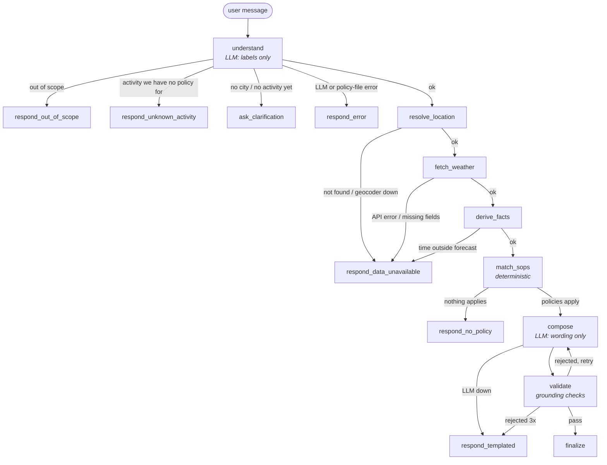

# Weather-Advisory Support Bot

A LangGraph chat bot that answers outdoor-activity safety questions using live
Open-Meteo weather data, and gives advice **only** from written policy rules (SOPs).

> 🚧 Work in progress — being built phase by phase.

## Setup

```bash
python -m venv .venv
# Windows
.venv\Scripts\activate
# macOS / Linux
source .venv/bin/activate

pip install -r requirements.txt
cp .env.example .env      # then put your GROQ_API_KEY in .env (model: openai/gpt-oss-120b on Groq)
```

## Run the bot (terminal)

```bash
python -m app.cli                                              # interactive chat; /why /new /quit
python -m app.cli "Is it safe to go for a bike ride in Bhopal today?"   # one-shot, prints the answer + why
```

`/why` shows the path taken through the graph, the extracted intent, the policies applied and the exact
weather comparisons that triggered them.

## Architecture



Only `understand` and `compose` call the LLM. Every node on a failure path replies with fixed text
(no LLM), so failures can't hallucinate. Memory is a LangGraph `MemorySaver` checkpointer keyed by a
session id: within a session the bot remembers the city, activity, who's going, the time window and what
it cited last; a new session starts empty.

### Where the non-negotiables are enforced

| Requirement | Enforced in |
|---|---|
| Every answer traceable to an SOP, or says none applies | `app/grounding.py` `validate_draft` (every matched policy cited inline, no others); `app/responses.py` `footer` (code-built "Policy basis"); `respond_no_policy` / `respond_unknown_activity` |
| Policy changes need no code changes | `app/sop_loader.py` re-reads `sops/*.yaml` on every request; intent labels are generated from the vocabulary + SOP files (`app/intent.py` `build_intent_model`) |
| Never answer with a forecast we don't have | `app/weather.py` (every failure → `WeatherDataError`), `app/facts.py` (`WindowUnavailable`), graph routes all of them to `respond_data_unavailable`; `app/matcher.py` skips SOPs whose data is missing |
| Never invent advice when no policy covers it | `app/matcher.py` (closed activity vocabulary, all-clear safety belt), templated `respond_no_policy` / `respond_unknown_activity` |
| The model composes language, never facts | `app/compose.py` (the LLM writes `{placeholders}`, not numbers) + `app/grounding.py` (rejects any number the model typed that isn't a constant from the policy text; `render_answer` substitutes the API values) |

## Useful commands (so far)

```bash
# Unit tests
python -m pytest -q

# See the live weather "facts" the bot would reason over, for any city / time window
python -m app.inspect_weather Bhopal
python -m app.inspect_weather "New Delhi" --day tomorrow --part afternoon

# Regenerate the synthetic weather fixtures used by tests/evals
python -m evals.fixtures.build_synthetic

# Validate all SOPs and print the policy table
python -m app.sop_loader
```

Rain-system detection thresholds and time-window hours are in `config/facts_config.yaml`.

## The policies (SOPs)

SOPs live in `sops/`, **one YAML file per policy**.
*Why YAML files:* a policy team can read and edit them without knowing Python, comments explain
intent next to the rule, each policy change is its own reviewable git diff, and adding a policy
means adding one file.

| ID | Category | Severity | When it applies |
|---|---|---|---|
| SOP-001 | general_hazard | critical | A multi-day heavy-rain system is detected (any activity; **leads the answer**) |
| SOP-002 | exercise | high | UV index ≥ 8 during outdoor exercise |
| SOP-003 | exercise | moderate | Feels-like ≥ 35 °C during strenuous exercise |
| SOP-004 | travel | high | Gusts ≥ 40 km/h on a bicycle or two-wheeler |
| SOP-005 | travel | moderate | Rain chance ≥ 70% on a journey |
| SOP-006 | travel | high | Visibility < 1 km or fog while driving/riding |
| SOP-007 | vulnerable_groups | high | Feels-like ≥ 35 °C or UV ≥ 6 with children, elderly or pregnant people |
| SOP-008 | vulnerable_groups | moderate | ≥ 32 °C when taking a pet out |
| SOP-009 | leisure | info / low / moderate | **Fuzzy:** picnic / park / outdoor event, graded good / mixed / poor by a 5-factor rubric |
| SOP-010 | general_hazard | high | Thunderstorm in the activity window |
| SOP-011 | exercise | low | Light rain (< 2.5 mm/h) while walking, running or hiking |
| SOP-012 | general | info | **All-clear** fallback: nothing else applies and values are within ordinary bands |

Each SOP declares which activities/audiences it covers, a condition over named weather facts
(`all` / `any` / `not` with operators like `>=`, `between`), a severity, and guidance text whose
numbers are `{fact}` placeholders filled from the live forecast.

### Adding a policy (no code changes, no restart)

1. Copy `sops/_TEMPLATE.yaml` to `sops/SOP-013-your-policy.yaml` and fill it in.
   Available facts: `python -m app.inspect_weather <city>`. Vocabulary: `config/vocabulary.yaml`.
2. Run `python -m app.sop_loader`: it validates every file and reports mistakes by file and field.
3. Ask the bot a matching question. SOPs are re-read on every request.

### How matching works, and what happens when several SOPs apply

Matching is **deterministic code** (`app/matcher.py`), not the model:

1. **Applicability.** The SOP must cover the user's activity (`[any]` = any activity in our
   vocabulary, never an unknown one) and, if it names audiences, one of them must be present.
2. **Conditions.** Evaluated against the live facts. If a value the SOP needs is missing, the SOP
   is skipped: we never act on data we don't have. Rubric SOPs count passed factors to pick a grade.
3. **Fallback.** The all-clear (SOP-012) is used only when nothing else applies, and only while every
   value is in its ordinary bands. Otherwise the answer is "no guidance".
4. **Conflict policy.** All matching SOPs are ranked by **override first** (the rain system always leads),
   then **severity** (critical → info), then **specificity** (an SOP written for this activity or
   audience beats a generic one), then ID for a stable order. The **top 3** get full guidance, and any
   further matches are named and cited as "also applies".
   *Why:* one winner would drop real hazards (high UV *and* strong wind on the same ride), while
   listing everything gets long. Leading with the most severe keeps the answer honest and readable,
   and every applicable policy is still cited.

Every match records the exact comparisons that made it apply (e.g. `window_gusts_max_kmh = 58.0 km/h (>= 40)`),
so "why did it say that?" always has an answer. To see this for any scenario:

```bash
python -m app.matcher --city Bhopal --activity cycling
python -m app.matcher --fixture synthetic_rain_system_subtle --activity picnic --part afternoon
python -m app.matcher --fixture synthetic_high_uv --activity park_visit --audience child --part afternoon
```

Run instructions for the chat frontend and the eval suite will be added as those phases land.
